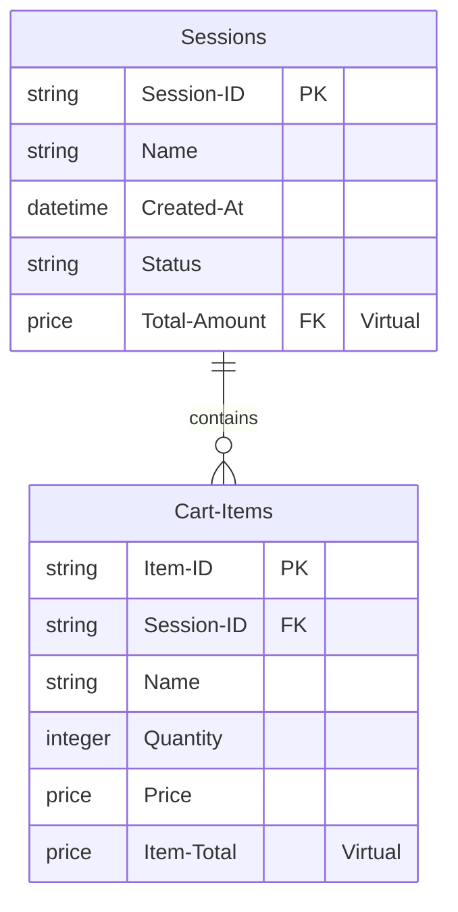

# Google Sheet Schema & AppSheet Database Configuration

This document defines the physical database schema for Google Sheets and the corresponding AppSheet column configurations required to support the migrated Shopping Cart application.

---

## 💾 1. Database Overview

The AppSheet application utilizes a relational database structure consisting of two tables. 
- **Physical columns** are defined in the underlying Google Sheet.
- **Virtual columns** are defined and computed dynamically inside AppSheet and do not occupy space in the Google Sheet.



---

## 📋 2. Sessions Table Schema

The `Sessions` table tracks individual shopping sessions, including both active carts and archived/checked-out checkouts.

### Physical Column Headers (Google Sheet)
These must be the exact column headers on the `Sessions` sheet:
`Session ID`, `Name`, `Created At`, `Status`

### Column Configurations

| Column Name | Source | Key? | Label? | AppSheet Type | Required? | Initial Value | Editable_If / Update Constraint | Valid_If / Constraints | AppSheet Formula / Description |
| :--- | :--- | :--- | :--- | :--- | :--- | :--- | :--- | :--- | :--- |
| **Session ID** | Physical | Yes | No | `Text` | Yes | `UNIQUEID()` | `FALSE` | | Automatically generated unique identifier. |
| **Name** | Physical | No | Yes | `Text` | Yes | | `[Status] = "Active"` | | Friendly name for the session (e.g., "Weekly Groceries"). |
| **Created At** | Physical | No | No | `DateTime` | Yes | `NOW()` | `FALSE` | | Timestamp of session creation. |
| **Status** | Physical | No | No | `Enum` | Yes | `"Active"` | `[Status] = "Active"` | Enum values: `"Active"`, `"Checked Out"` | Controls whether items can still be added or edited. |
| **Total Amount** | Virtual | No | No | `Price` | No | | (N/A) | | `SUM(SELECT(Cart Items[Item Total], [Session ID] = [_THISROW].[Session ID]))` <br><br> Computes the total cost of all items in this session. |

---

## 🛒 3. Cart Items Table Schema

The `Cart Items` table holds individual line items belonging to a specific shopping session.

### Physical Column Headers (Google Sheet)
These must be the exact column headers on the `Cart Items` sheet:
`Item ID`, `Session ID`, `Name`, `Quantity`, `Price`

### Column Configurations

| Column Name | Source | Key? | Label? | AppSheet Type | Required? | Initial Value | Editable_If / Update Constraint | Valid_If / Constraints | AppSheet Formula / Description |
| :--- | :--- | :--- | :--- | :--- | :--- | :--- | :--- | :--- | :--- |
| **Item ID** | Physical | Yes | No | `Text` | Yes | `UNIQUEID()` | `FALSE` | | Automatically generated unique identifier. |
| **Session ID** | Physical | No | No | `Ref` | Yes | | `[Session ID].[Status] = "Active"` | Reference to `Sessions` table | Links the line item to its parent session. |
| **Name** | Physical | No | Yes | `Text` | Yes | | `[Session ID].[Status] = "Active"` | | Name or description of the shopping item. |
| **Quantity** | Physical | No | No | `Number` | Yes | `1` | `[Session ID].[Status] = "Active"` | `[_THIS] >= 1` | The number of units being purchased. Minimum value of 1. |
| **Price** | Physical | No | No | `Price` | Yes | `0.00` | `[Session ID].[Status] = "Active"` | `[_THIS] >= 0` | The unit price of the item. Minimum value of 0.00. |
| **Item Total** | Virtual | No | No | `Price` | No | | (N/A) | | `[Quantity] * [Price]` <br><br> Computes the subtotal for this item. |

---

## 📄 4. Ready-to-Use CSV Templates

To initialize your Google Sheets data source, create two worksheets named `Sessions` and `Cart Items` and paste the following CSV contents into cell **A1** of each sheet.

### `Sessions` CSV Template
```csv
Session ID,Name,Created At,Status
```

### `Cart Items` CSV Template
```csv
Item ID,Session ID,Name,Quantity,Price
```
